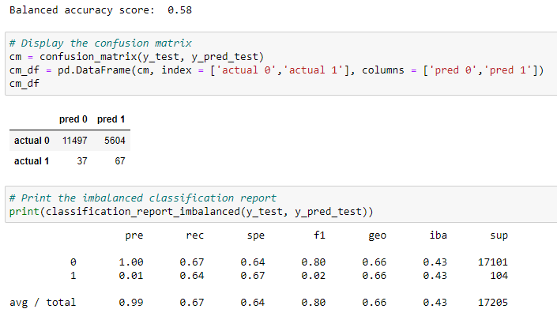
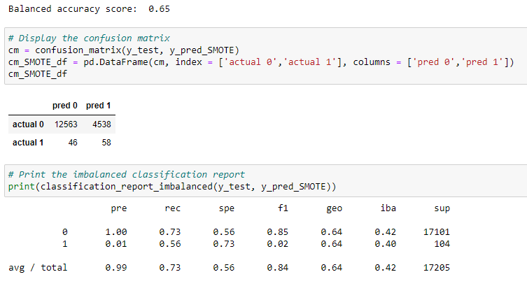
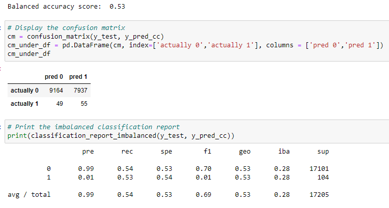

# Credit_Risk_Analysis  
  
### Overview of Analysis  
  
The project goal is to evaluate resampling and ensemble classification algorithms using a  credit risk dataset from Q1 2019 of LendingClub.  The number of low risk loans significantly outnumbers the number of high risk loans; the dataset is unbalanced.  
  
The project evaluated the success of a series of resampling algorithms using the sklearn  logistic regression:  
  
1. The imblearn library RandomOverSampler  
2. The imblearn SMOTE oversampler  
3. The imblearn ClusterCentroids undersampler  
4. The imblearn combination over and under sampler SMOTEENN  
  
The project further evaluated 2 endemble classification algorithms:  
  
1. The imblearn balanced random forest classifier  
2. The sklearn ada boost classifier  
  
The results of the logistic regressions and the ensemble classifiers are determined from the balanced accuracy scores and the precision, recall, and f1 scores (calculated from the confusion matrices).  
  
### Results:  

The results of logistic regression after resampling are summarized below.  
  
The random over sampler:  
- balanced accuracy score:  0.58  
- precision:  
- - for low risk- 1.0:  11497/(11497+37)  
- - for high risk - 0.01:  67/(67+5604)  
- recall:  
- - for low risk- 0.67:  11497/(11497+5604)  
- - for high risk- 0.64:  67/(67+37)  
- f1 score:  
- - for low risk- 0.8  
- - for high risk- 0.02  
  
  
The SMOTE over sampler:  
- balanced accuracy score:  0.65  
- precision:  
- - for low risk- 1.0:  12563/(12563+46)  
- - for high risk - 0.01:  58/(58+4538)  
- recall:  
- - for low risk- 0.73:  12563/(12563+4538)  
- - for high risk- 0.56:  58/(58+46)  
- f1 score:  
- - for low risk- 0.85  
- - for high risk- 0.02
  
  
The cluster centroids under sampler:  
- balanced accuracy score:  0.53  
- precision:  
- - for low risk- 0.99:  9164/(9164+49)  
- - for high risk - 0.01:  55/(55+7937)  
- recall:  
- - for low risk- 0.54:  9164/(9164+7937)  
- - for high risk- 0.53:  55/(55+49)  
- f1 score:  
- - for low risk- 0.7  
- - for high risk- 0.01  

  
The SMOTEENN combination resampler:  
- balanced accuracy score:  0.66  
- precision:  
- - for low risk- 1.0:  11497/(11497+37)  
- - for high risk - 0.01:  67/(67+5604)  
- recall:  
- - for low risk- 0.67:  11497/(11497+5604)  
- - for high risk- 0.64:  67/(67+37)  
- f1 score:  
- - for low risk- 0.8  
- - for high risk- 0.02  

  
The balanced random forest classifier:  
- balanced accuracy score:  0.77  
- precision:  
- - for low risk- 1.0:  15215/(15215+36)  
- - for high risk - 0.03:  65/(65+1889)  
- recall:  
- - for low risk- 0.89:  15215/(15215+1889)  
- - for high risk- 0.64:  65/(65+36)  
- f1 score:  
- - for low risk- 0.94  
- - for high risk- 0.06  

  
The Ada boost classifier:  
- balanced accuracy score:  0.69  
- precision:  
- - for low risk- 1.0:  17099/(17099+63)  
- - for high risk - 0.88:  38/(38+5)  
- recall:  
- - for low risk- 1.0:  17099/(17099+5)  
- - for high risk- 0.38:  38/(38+63)  
- f1 score:  
- - for low risk- 1.0  
- - for high risk- 0.53  
  
### Summary:  
  
The challenge in the credit risk dataset is to categorize the high credit risks (1 in this dataset).  In general, the resampling algorithms evaluated with the logistic regressor perform poorly.  None of the resampling algorithms seem to help identify the high credit risks.  
  
The ensemble classification models perform better but neither algorithm is ideal.  
  
The balanced random forest does identify 64% of the actual high credit risks, but there are thousands of false positives.  
  
THe Ada boost classifier has considerably fewer false positives for high credit risk.  However, it only identifies 38% of the actual high credit risks.  